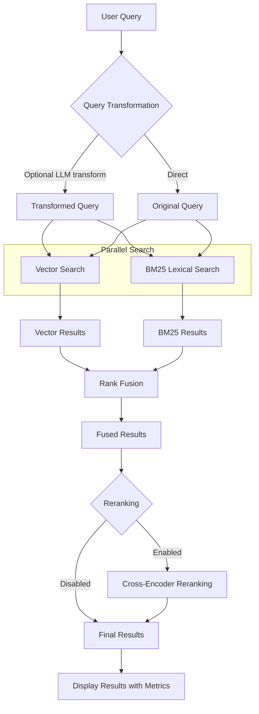

# Query System with Contextual Retrieval

This document describes the query system implemented in the Epic Documentation RAG system, which leverages Anthropic's contextual retrieval methodology to enhance search capabilities.

## Overview

Our RAG system implements an advanced query workflow that combines multiple search techniques:

1. **Query transformation** - Rewriting natural language queries to better match corpus terminology
2. **Hybrid search** - Combining vector and lexical search strategies
3. **Rank fusion** - Merging results from different search techniques
4. **Reranking** - Fine-tuning result ordering with cross-encoders

## Architecture



## Components

### Query Transformation

The system can optionally transform user queries using an LLM to better match the language and terminology in the documentation:

- Improves search when user terminology differs from documentation
- Understands user intent and matches to relevant document terms
- Controlled via the `transform` parameter
- Implemented in `RetrieveContextUseCase.execute()`

### Vector Search

Vector search uses embeddings to find semantically similar content:

- Query is embedded using the same model used for document embeddings
- Search is performed against embedded document chunks in the vector database
- Benefits from contextual enrichment, as chunk embeddings include context
- Implementation: `RetrievalService._vector_search()`

### BM25 Lexical Search

BM25 search provides keyword-based retrieval:

- Uses the BM25Okapi algorithm from the `rank_bm25` library
- Performs tokenization and builds an in-memory index
- Scores documents based on term frequency and inverse document frequency
- Implementation: `BM25SearchService.search()`

### Contextual Enrichment

Documents are enhanced with contextual descriptions during ingestion:

- For each chunk, an LLM generates a description of context
- Context is prepended to chunk content before embedding
- Context is also stored in chunk metadata
- Enrichment gives embeddings better semantic understanding
- Implementation: `OllamaContextualEnrichmentService.enrich()`

### Rank Fusion

Results from multiple search systems are combined using reciprocal rank fusion:

- Formula: `score = weight * 1/(k + rank + 1)`
- Configurable weights for different search methods (default: vector 0.6, BM25 0.4)
- Normalizes scores across different retrieval methods
- Implementation: `RecipRankFusionService.fuse_results()`

### Reranking

A cross-encoder model reranks results to improve relevance:

- Evaluates query-document pairs directly
- Default model: "mixedbread-ai/mxbai-rerank-large-v1"
- Applied as final step after fusion
- Implementation: `CrossEncoderRerankerService.rerank()`

## Query Command Usage

The unified query command provides access to all search capabilities:

```bash
# Basic query with default settings (hybrid search)
./rag query "How do I access my email in Epic?"

# BM25-only search
./rag query "How do I access my email in Epic?" --search-type bm25

# Vector-only search
./rag query "How do I access my email in Epic?" --search-type vector

# Hybrid search with custom weights (70% vector, 30% BM25)
./rag query "How do I access my email in Epic?" --search-type hybrid --vector-weight 0.7 --bm25-weight 0.3

# Enable query transformation
./rag query "How do I access my email in Epic?" --transform

# Enable reranking 
./rag query "How do I access my email in Epic?" --rerank

# Show detailed metrics
./rag query "How do I access my email in Epic?" --show-details
```

## Performance Metrics

The query system collects detailed performance metrics:

- **Recall@k**: Proportion of relevant documents retrieved
- **Precision@k**: Proportion of retrieved documents that are relevant
- **Mean Reciprocal Rank (MRR)**: Position of first relevant result
- **NDCG@k**: Normalized Discounted Cumulative Gain
- **Timing**: Execution time for each search component

Metrics are displayed when using the `--show-details` flag.

## How Contextual Retrieval Improves Results

Anthropic's contextual retrieval methodology provides several key benefits:

1. **Enhanced semantic understanding** - By adding context to chunks, the system better understands where information fits in the broader document
2. **Better natural language matches** - Finds relevant content even when query terms don't match exactly
3. **Improved ranking** - Context helps prioritize more relevant chunks
4. **Reduced hallucination** - Retrieved content is more reliable as source context

Evaluation shows that contextual enrichment consistently improves search relevance and ranking scores compared to baseline embedding approaches.