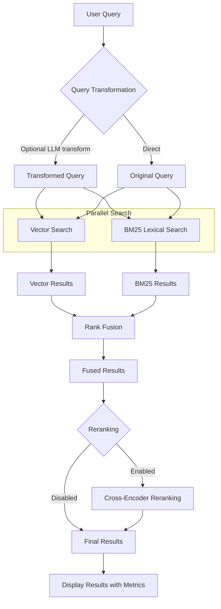

# Help Center Documentation RAG System

A generic, configurable system for scraping, processing, and searching help center documentation. This project provides a powerful retrieval-augmented generation (RAG) system based on Anthropic's Contextual Retrieval methodology.

This system can be configured to work with any help center or documentation website, providing:
1. Automated documentation scraping
2. Intelligent content processing and chunking
3. Advanced search capabilities
4. Question-answering through RAG
5. Flexible configuration for different domains

The primary components of this system are:

1. **Web Scraper**: Configurable scraper for any help center website
2. **Documentation RAG System**: A retrieval system with contextual enrichment
3. **CLI Interface**: A command-line interface for interacting with the system

## Features

- **Data Ingestion Pipeline**: Converts HTML to Markdown, chunks documents, and stores them in databases
- **Contextual Enrichment**: LLM-based context description generation to enhance retrieval
- **Hybrid Search**: Combines vector and lexical search for better results
- **Rank Fusion**: Merges results from different search techniques
- **Reranking**: Fine-tunes result ordering with cross-encoders

## Architecture Overview

The system is built on Domain-Driven Design principles with distinct layers:

1. **Domain Layer**: Core models and interface definitions
2. **Application Layer**: Use cases and business logic
3. **Infrastructure Layer**: Technical implementations of the domain interfaces
4. **Interface Layer**: CLI and API interfaces for user interaction



## Contextual Enrichment

This system uses Anthropic's contextual enrichment technique to improve retrieval quality. When a document is ingested:

1. The document is chunked into manageable segments
2. For each chunk, an LLM generates a short context description
3. This context is added to both the chunk metadata and prepended to the content
4. The enriched chunks are then embedded and stored in the vector database

Benefits of contextual enrichment:
- Improved retrieval quality, especially for natural language queries
- Better understanding of document structure and relationships
- Enhanced semantic matching between queries and documents

## CLI Commands

The system provides a comprehensive CLI interface for interacting with the RAG system:

```bash
# Basic query with default settings (hybrid search)
./rag query "How do I reset my password?"

# Ask a question and get an answer using RAG
./rag ask "How do I configure notifications?"

# Show database statistics
./rag db info

# List documents in the database
./rag db list-documents

# View a specific document
./rag db inspect-document --title "Getting Started"

# Ingest new documents
./rag documents ingest --source-dir ./data/markdown
```

## Installation and Setup

1. Install Python dependencies:
   ```bash
   uv install -e .
   ```

2. Install TypeScript dependencies (for the HTML to MD converter):
   ```bash
   bun install
   ```

3. Set up environment variables:
   ```bash
   export HELP_RAG_EMBEDDING_PROVIDER=huggingface
   export HELP_RAG_LLM_PROVIDER=ollama
   export HELP_RAG_LLM_MODEL=llama3.1
   ```

4. Reset the database (if needed):
   ```bash
   just reset
   ```

5. Run the CLI:
   ```bash
   ./rag --help
   ```

## RAG System Features

- Retrieval-Augmented Generation using Anthropic's Contextual Retrieval methodology
- Domain-driven design with clean architecture
- Dynamic document chunking optimized for context retrieval
- Two-stage retrieval process for better query accuracy
- Hybrid search combining BM25 (lexical) and vector (semantic) search with rank fusion
- Multiple BM25 implementations (rank-bm25 and Huggingface's bm25s)
- Cross-encoder reranking for improved result relevance scoring (mixedbread-ai/mxbai-rerank-large-v1)
- Query transformation using local LLMs (Ollama integration with gemma3:27b)
- Multiple embedding providers (HuggingFace E5-large-v2, OpenAI, Google Gemini)
- Efficient two-level embedding caching (memory + disk)
- Qdrant vector database integration
- SQLite document store with JSON support
- ZenML pipeline orchestration
- Command-line interface with Rich formatting

## Installation

```bash
# Clone the repository
git clone https://github.com/yourusername/epic-help.git
cd epic-help

# Install dependencies
bun install

# Install globally (optional)
bun install-global
```

## Usage

```bash
# Show all available commands
epic-help

# Get help for a specific command
epic-help help <command>
# or
epic-help <command> --help
```

### Available Commands

The CLI provides the following commands:

- **crawl**: Crawl the Epic docs website and output to JSON with images
- **convert**: Convert scraped JSON to markdown format with local image references
- **condense**: Reduce markdown content to fit within context windows
- **count**: Estimate token counts for LLM context windows

### Workflow Examples

Full workflow from crawling to tokenization:

```bash
# 1. Crawl the documentation website with images
epic-help crawl --depth 3 --concurrency 8 --images-dir output/images

# 2. Convert HTML to markdown with local image references
epic-help convert

# 3. Condense markdown content
epic-help condense output/epic-docs.md output/epic-docs-condensed.md

# 4. Count tokens for different LLM models
epic-help count output/epic-docs-condensed.md
```

For screenshots only (default):
```bash
epic-help crawl --images-dir output/images
```

For all images including icons:
```bash
epic-help crawl --all-images --images-dir output/images
```

With auto-saving for crash recovery:
```bash
epic-help crawl --images-dir output/images --autosave 300000
```

To disable image download:
```bash
epic-help crawl --no-images
```

## Command Details

### crawl

```bash
epic-help crawl [options]

Options:
  --url, -u <url>           Base URL to crawl
  --output, -o <file>       Output JSON file path
  --concurrency, -c <num>   Number of parallel workers
  --depth, -d <num>         Maximum crawl depth
  --max, -m <num>           Maximum pages to process
  --timeout, -t <ms>        Page load timeout in milliseconds
  --wait, -w <ms>           Wait time for dynamic content in milliseconds
  --interval, -i <ms>       Delay between requests in milliseconds
  --images-dir <dir>        Directory to save downloaded images
  --no-images               Disable image downloading
  --all-images              Download all images (not just screenshots)
  --autosave <ms>           Interval in milliseconds to auto-save partial results
```

### convert

```bash
epic-help convert [options]

Options:
  --input, -i <file>       Input JSON file path
  --output, -o <file>      Output markdown file path
  --metadata, -m <file>    Output metadata JSON file path
```

### condense

```bash
epic-help condense <input-file> <output-file> [options]

Options:
  --abbreviate             Enable abbreviations for greater reduction
  --summarize              Enable aggressive content summarization
```

### count

```bash
epic-help count <file-path>
```

## Requirements

- [Bun](https://bun.sh/) runtime
- Playwright browsers (installed automatically)

## Development

- Install dependencies: `bun install`
- Start the CLI tool: `bun start`
- Typecheck: `bun x tsc --noEmit`
- Format: `bun x prettier --write "**/*.{ts,js,json}"`
- Lint: `bun run lint`

## HTML to Markdown Converter Usage

The HTML to Markdown converter is optimized for Epic documentation structure.

```bash
# Basic conversion from a JSON file
python -m html2md convert --file path/to/epic/docs.json

# Convert a specific page by ID
python -m html2md convert --file path/to/epic/docs.json --page-id 12345

# List available pages in the JSON file
python -m html2md list --file path/to/epic/docs.json

# Show tool information
python -m html2md info
```

The converter provides special preprocessing for:
- Nested lists (fixing indentation issues)
- Inline styles (converting to semantic HTML)
- Image paths (resolving to local references)
- Link handling (processing local references)

## RAG System Usage

The RAG system builds on the converted documentation to provide intelligent retrieval of Epic documentation.

### Project Structure

```
epic_rag/
├── domain/                 # Core business logic and entities
│   ├── models/             # Domain entities
│   ├── repositories/       # Data access interfaces
│   └── services/           # Business logic interfaces
├── application/            # Use cases and orchestration
│   ├── pipelines/          # ZenML pipelines
│   └── use_cases/          # Application use cases
├── infrastructure/         # Technical implementations
│   ├── config/             # Configuration
│   ├── embedding/          # Vector database implementations
│   └── persistence/        # Data persistence implementations
└── interfaces/             # User interfaces
    └── cli/                # Command-line interface
```

### Contextual Retrieval Methodology

This system implements Anthropic's Contextual Retrieval approach, which improves upon standard RAG systems by:

1. **Two-Stage Retrieval**: Initial broader retrieval followed by a more focused retrieval
2. **BM25 + Vector Hybrid Search**: Combining lexical (exact keyword) and semantic (vector) search with rank fusion
3. **Cross-Encoder Reranking**: Using a dedicated reranker model to improve result relevance scoring
4. **Dynamic Chunk Sizing**: Intelligently determining chunk sizes based on content
5. **Context-Aware Merging**: Combining retrieved chunks based on semantic relatedness
6. **Relevance Filtering**: Using similarity scores to filter retrieved chunks by relevance
7. **Query Transformation**: Rewriting queries to better match document corpus semantics using LLMs
8. **Contextual Enrichment**: Using LLMs to generate context for chunks before embedding

### Basic Usage

```bash
# Install the RAG system
pip install -e .

# Ingest documents
help-rag ingest --source-dir data/markdown

# Query the system
help-rag query "How do I configure email notifications?"

# Show system information
help-rag info

# Test the embedding service
help-rag test-embed "How do I export data from the system?"

# Compare text similarity
help-rag test-embed "How do I compare quotes?" --compare "What's the process for generating a proposal?"

# Visualize document chunks
help-rag chunks --file data/markdown/email.md --dynamic
```

### Testing Database and Embeddings

```bash
# Test the database
help-rag test-db

# Test with the default embedding provider (HuggingFace)
help-rag test-embed "This is a test of the embedding service"

# Test with local HuggingFace model on GPU
help-rag test-embed "This is a test of the embedding service" --provider huggingface

# Test with a specific provider (OpenAI)
help-rag test-embed "This is a test of the embedding service" --provider openai

# Test with Gemini embeddings
help-rag test-embed "This is a test of the embedding service" --provider gemini

# Test query transformation using local LLM
help-rag transform-query "How do I access my email in Epic?"

# Test query transformation with a specific model
help-rag transform-query "How do I compare different options?" --model gemma3:27b

# Test BM25 search (lexical/keyword search)
help-rag bm25 "renew subscription account user"

# Test BM25 search with full content display
help-rag bm25 "faxing setup configuration" --full-content

# Test hybrid search combining BM25 and vector search
help-rag hybrid-search "How do I configure VINlink Decoder for my account?"

# Test hybrid search with detailed output
help-rag hybrid-search "How do I prepare a report with multiple data sources?" --show-separate

# Test hybrid search with custom weights
help-rag hybrid-search "quote results comparison carrier" --bm25-weight 0.6 --vector-weight 0.4

# Test with reranking enabled
help-rag hybrid-search "How do I set up integrations for my account?" --rerank

# Compare semantic similarity between texts using local model
help-rag test-embed "This is a help center documentation system" --compare "The system helps users manage documents and queries"

# Compare using Gemini
help-rag test-embed "This is a help center documentation system" --compare "The system helps users manage documents and queries" --provider gemini

# Compare using OpenAI
help-rag test-embed "This is a help center documentation system" --compare "The system helps users manage documents and queries" --provider openai

# View cache statistics
help-rag cache stats

# Clear cache entries older than 7 days
help-rag cache clear --days 7
```

### Environment Variables

The system uses the following environment variables:

```
# API Keys for embeddings (choose one or both)
OPENAI_API_KEY=your_openai_api_key
GEMINI_API_KEY=your_gemini_api_key

# Embedding configuration
HELP_RAG_EMBEDDING_PROVIDER=huggingface  # or openai, gemini
HELP_RAG_EMBEDDING_API_KEY=your_embedding_api_key  # for cloud providers

# LLM configuration for query transformation
HELP_RAG_LLM_PROVIDER=ollama  # Local LLM provider
HELP_RAG_LLM_MODEL=gemma3:27b  # Model to use for transformations

# Provider-specific model configuration
HELP_RAG_OPENAI_EMBEDDING_MODEL=text-embedding-3-small
HELP_RAG_GEMINI_EMBEDDING_MODEL=gemini-embedding-exp-03-07
HELP_RAG_HUGGINGFACE_MODEL=intfloat/e5-large-v2

# HuggingFace specific settings (for local embeddings)
HELP_RAG_EMBEDDING_DEVICE=cuda  # cuda, cpu, mps

# Embedding cache settings
HELP_RAG_CACHE_ENABLED=true  # Enable caching of embeddings
HELP_RAG_CACHE_MEMORY_SIZE=1000  # Number of entries to keep in memory
HELP_RAG_CACHE_EXPIRATION_DAYS=30  # Embeddings expire after this many days
HELP_RAG_CACHE_CLEAR_ON_STARTUP=false  # Whether to clear expired entries on startup

# Retrieval configuration
HELP_RAG_FIRST_STAGE_K=20  # Number of results in first stage
HELP_RAG_SECOND_STAGE_K=5  # Number of results in second stage
HELP_RAG_MIN_RELEVANCE_SCORE=0.7  # Minimum relevance score for filtering
HELP_RAG_ENABLE_BM25=true  # Enable BM25 search
# Using BM25S for lexical search (Huggingface's optimized implementation)
HELP_RAG_BM25_WEIGHT=0.4  # Weight for BM25 results in hybrid search
HELP_RAG_VECTOR_WEIGHT=0.6  # Weight for vector results in hybrid search
HELP_RAG_ENABLE_QUERY_TRANSFORMATION=true  # Enable query transformation
HELP_RAG_ENABLE_CHUNK_MERGING=true  # Enable merging of related chunks
HELP_RAG_ENABLE_CONTEXTUAL_ENRICHMENT=true  # Enable LLM-based contextual enrichment for chunks

# Reranker configuration
HELP_RAG_RERANKER_ENABLED=false  # Enable cross-encoder reranking
HELP_RAG_RERANKER_MODEL=mixedbread-ai/mxbai-rerank-large-v1  # Reranker model to use
HELP_RAG_RERANKER_TOP_K=10  # Maximum number of results to return after reranking

# Qdrant configuration (optional for remote Qdrant)
HELP_RAG_QDRANT_URL=https://your-qdrant-instance.com
HELP_RAG_QDRANT_API_KEY=your_qdrant_api_key
HELP_RAG_QDRANT_COLLECTION=help_docs
```

### ZenML Pipelines

The system uses ZenML for pipeline orchestration, providing several pipelines for different needs:

#### Running Pipelines with CLI

Use the built-in CLI command to run ZenML pipelines:

```bash
# Run the orchestration pipeline (full workflow)
help-rag zenml-run --source-dir data/markdown --pipeline orchestration

# Run only the document processing pipeline
help-rag zenml-run --source-dir data/markdown --pipeline document_processing

# Run only the query evaluation pipeline
help-rag zenml-run --source-dir data/markdown --query-file data/test_queries.txt --pipeline query_evaluation

# Run with custom parameters
help-rag zenml-run --source-dir data/markdown --pattern "**/*.md" --limit 10 --min-chunk-size 400 --max-chunk-size 900

# Run with contextual enrichment disabled
help-rag zenml-run --source-dir data/markdown --pipeline document_processing --skip-enrichment
```

#### Running Pipelines Directly

You can also run the pipelines directly using Python:

```bash
# Run document processing pipeline
python -m epic_rag.application.pipelines.document_processing_pipeline \
  --source-dir data/markdown \
  --dynamic-chunking

# Run query evaluation pipeline
python -m epic_rag.application.pipelines.query_evaluation_pipeline \
  --query-file data/test_queries.txt

# Run orchestration pipeline
python -m epic_rag.application.pipelines.orchestration_pipeline \
  --source-dir data/markdown
```

#### Pipeline Overview

1. **Feature Engineering Pipeline**: End-to-end processing from HTML to vector database
2. **Document Processing Pipeline**: Handles document loading, preprocessing, chunking, contextual enrichment, and ingestion
3. **Query Evaluation Pipeline**: Evaluates query performance against a test set
4. **Orchestration Pipeline**: Combines all steps in an end-to-end workflow

#### Feature Engineering Pipeline

The feature engineering pipeline processes documents directly from the HTML-to-Markdown converter output:

```bash
# Process all documents with the feature engineering pipeline
help-rag pipeline feature-engineering

# Process a single document
help-rag pipeline feature-engineering --index 0

# Process a batch of documents
help-rag pipeline feature-engineering --offset 0 --limit 10

# Test without saving to database
help-rag pipeline feature-engineering --index 0 --dry-run

# Skip contextual enrichment or image descriptions
help-rag pipeline feature-engineering --no-enrich --no-images
```

The pipeline handles these steps:
1. Converting HTML to Markdown
2. Chunking documents with dynamic sizing
3. Adding context for each chunk
4. Adding image descriptions where applicable
5. Loading chunks to the document store
6. Embedding chunks and loading to the vector database

#### Managing ZenML

```bash
# View pipeline runs
zenml pipeline runs list

# Get details about a specific run
zenml pipeline runs describe <run-id>

# View ZenML dashboard (if running with server)
zenml up
```

## License

MIT